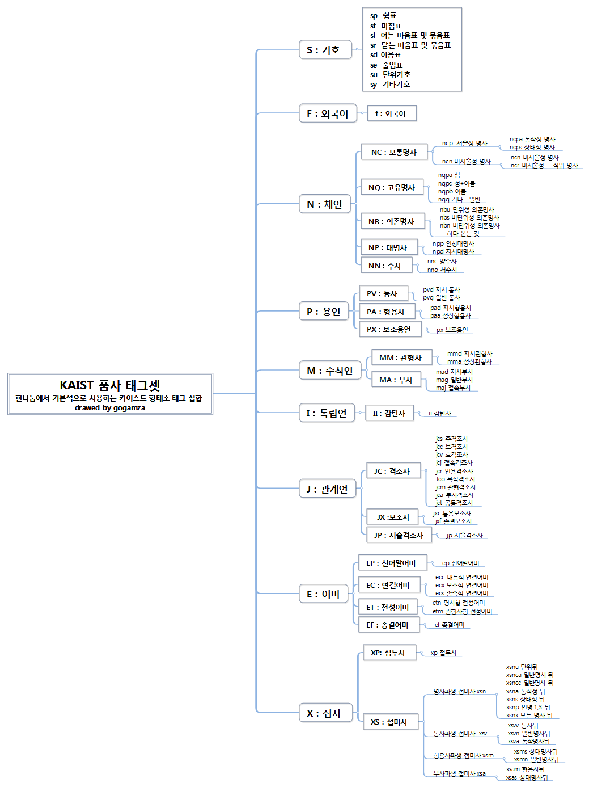
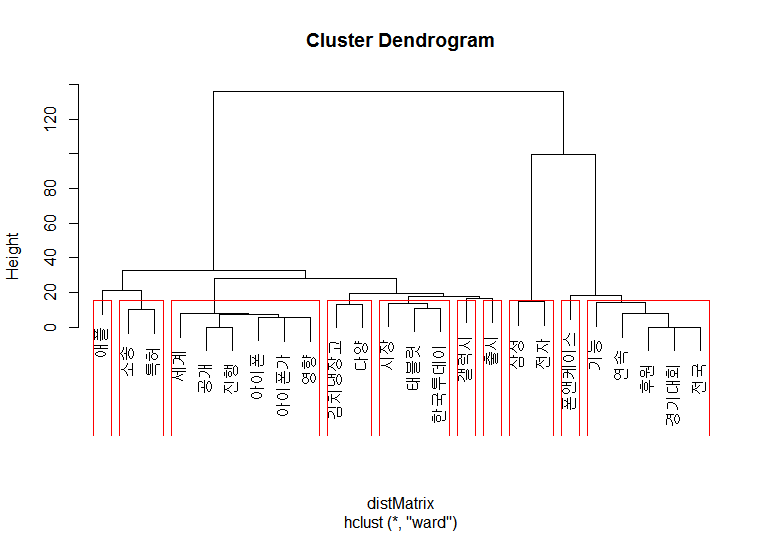

This page is for showing simple example about KoNLP with some Hangul.

Newest version of this document is on  [KoNLP github](https://github.com/haven-jeon/KoNLP/blob/master/etcs/KoNLP-API.md)

# Introduction to KoNLP API

## extractNoun 

function for extract Nouns from sentences.
Internally, runs pos tagger and only select Nouns from set.

```{r}
library(KoNLP)

useSejongDic()

extractNoun("롯데마트가 판매하고 있는 흑마늘 양념 치킨이 논란이 되고 있다.")

#now don't need to apply 'sapply' about multiple sentences
#sapply(c("R은 free 소프트웨어이고, [완전하게 무보증]입니다.", "일정한 조건에 따르면, 자유롭게 이것을 재배포할수가 있습니다."), extractNoun)

extractNoun(c("R은 free 소프트웨어이고, [완전하게 무보증]입니다.", 
              "일정한 조건에 따르면, 자유롭게 이것을 재배포할수가 있습니다.")
            )

```


## SimplePos09 

This function returns pos tagged terms using KAIST tag set only using 9 main tags.


```{r}
pos <- SimplePos09("롯데마트가 판매하고 있는 흑마늘 양념 치킨이 논란이 되고 있다.")
pos

pos$`롯데마트가`
```


## SimplePos22

This is similar with SimplePos09 but using more detail 22 tag set. 


```{r}
SimplePos22("롯데마트가 판매하고 있는 흑마늘 양념 치킨이 논란이 되고 있다.")
```


## MorphAnalyzer

show morph analysis result.


```{r}
MorphAnalyzer("롯데마트가 판매하고 있는 흑마늘 양념 치킨이 논란이 되고 있다.")
```


## Tag information

Mindmap of KAIST tag set .

 
_will provide English version of tag set as soon as possible_

original tag was taken from [Hannanum reference manual](http://semanticweb.kaist.ac.kr/home/index.php/HanNanum). 


## convertHangulStringToJamos

convert Hangul string to Jamo(Korean alphabet) string. return will be char vector with each syllable.

```{r}
convertHangulStringToJamos("R는 많은 공헌자에의한 공동 프로젝트입니다")
```


## convertHangulStringToKeyStrokes

Hangul string to keyboard strokes(2-bul). 
Strokes char will be full-width ascii character.


```{r}
convertHangulStringToKeyStrokes("R는 많은 공헌자에의한 공동 프로젝트입니다")
```


## HangulAutomata

Convert from Jamo(or keystroke) sequences to Hangul syllables.

```{r}
str <- convertHangulStringToJamos("배포 조건의 상세한것에 대해서는 'license()' 또는 'licence()' 라고 입력해주십시오")
str2 <-paste(str, collapse="")
str2
HangulAutomata(str2)
```


## useSejongDic, useSystemDic

change to [Sejong](https://github.com/haven-jeon/Sejong), Hannanum System, [NIADic](https://github.com/haven-jeon/NIADic).

```{R}
useSystemDic()
extractNoun("성긴털제비꽃은 너무 예쁘다.")
SimplePos09("성긴털제비꽃은 너무 예쁘다.")
SimplePos22("성긴털제비꽃은 너무 예쁘다.")
MorphAnalyzer("성긴털제비꽃은 너무 예쁘다.")
 
useSejongDic()
extractNoun("성긴털제비꽃은 너무 예쁘다.")
SimplePos09("성긴털제비꽃은 너무 예쁘다.")
SimplePos22("성긴털제비꽃은 너무 예쁘다.")
MorphAnalyzer("성긴털제비꽃은 너무 예쁘다.")


useNIADic()
extractNoun("성긴털제비꽃은 너무 예쁘다.")
SimplePos09("성긴털제비꽃은 너무 예쁘다.")
SimplePos22("성긴털제비꽃은 너무 예쁘다.")
MorphAnalyzer("성긴털제비꽃은 너무 예쁘다.")
```


## buildDictionary

User can make own dictionary using NIAdic and Sejong additional packages. 

```{r}
txt <- '미국 싱크탱크 전략국제문제연구소(CSIS)의 빅터 차 한국석좌는 9일(현지시간) 미국의 제45대 대통령으로 당선된 도널드 트럼프가 전시작전통제권(전작권)을 한국에 조기에 넘길 가능성이 있다고 전망했다.'


buildDictionary(ext_dic = c('sejong', 'woorimalsam'),user_dic = data.frame(term="전작권", tag='ncn'), category_dic_nms=c('political'))

extractNoun(txt)

```


## Use buildDictionary for mergeUserDic (mergeUserDic is deprecated)

Function can be usually used for appending new terms to user dictionary.

```{R}
#Rather than simply using the system dictionary, 
#it is better to extract nouns based on the rich vocabulary of the Korean dictionary(wooromalsam).
buildDictionary(ext_dic = "woorimalsam")

extractNoun("할리우드 톱스타 레오나르도 디카프리오는 '선행 전도사'다운 행보를 이어갔다.")

buildDictionary(ext_dic = "woorimalsam", user_dic=data.frame("디카프리오", "ncn"),replace_usr_dic = T)

extractNoun("할리우드 톱스타 레오나르도 디카프리오는 '선행 전도사'다운 행보를 이어갔다.")


# get dictionary as data.frame
head(get_dictionary('user_dic'))
```


## Auto-spacing 

Sometimes it is necessary to analyze sentences that are not spatially separated. In this case, automatic spacing is provided.

```{r, echo=F,message=F}
useSystemDic()
```


```{r}
extractNoun("아버지가방에들어가셨다.")

extractNoun("아버지가방에들어가셨다.", autoSpacing = T)

MorphAnalyzer("아버지가방에들어가셨다.", autoSpacing = T)

#SimplePos09("아버지가방에들어가셨다.", autoSpacing = T)

SimplePos22("아버지가방에들어가셨다.", autoSpacing = T)

```


# Examples

## Wordcloud example
Example will draw wordcloud after analyze Korean famous novel named "광장_최인훈"(can't include novel cause copyright, but you can find other good txt files).

1. read txt file.
2. parse using extractNoun().
3. draw wordcloud with word frequency 

	library(KoNLP)
	library(RColorBrewer)
	library(wordcloud)

	f <- file("광장_최인훈.txt", blocking=F)
	txtLines <- readLines(f)
	nouns <- sapply(txtLines, extractNoun, USE.NAMES=F)
	close(f)

	wordcount <- table(unlist(nouns))
	pal <- brewer.pal(12,"Set3")
	pal <- pal[-c(1:2)]
	wordcloud(names(wordcount),freq=wordcount,scale=c(6,0.3),min.freq=25,
			  random.order=T,rot.per=.1,colors=pal)


## Korean Twitter Analysis 

```{r, eval=F}
#referenced from http://www.rdatamining.com/

## @knitr init
library(twitteR)
# 
# n <- 200
# 
# keyword <- "삼성전자"
# 
# keyword <- enc2utf8(keyword)
# 
# rdmTweets <- searchTwitter(keyword,  n)

load(url("http://dl.dropbox.com/u/8686172/twitter.RData"))

nDocs <- length(rdmTweets)


## @knitr preprocess
library(KoNLP)
library(tm)


df <- do.call("rbind", lapply(rdmTweets, as.data.frame))

removeTwit <- function(x) {gsub("@[[:graph:]]*", "", x)}

df$ptext <- sapply(df$text, removeTwit)

removeURL <- function(x) { gsub("http://[[:graph:]]*", "", x)}

df$ptext <- sapply(df$ptext, removeURL)
useSejongDic()
df$ptext <- sapply(df$ptext, function(x) {paste(extractNoun(x), collapse=" ")}) 

#build corpus
myCorpus_ <- Corpus(VectorSource(df$ptext))
myCorpus_ <- tm_map(myCorpus_, removePunctuation)
myCorpus_ <- tm_map(myCorpus_, removeNumbers)
myCorpus_ <- tm_map(myCorpus_, tolower)
myStopwords <- c(stopwords('english'), "rt")
myCorpus_ <-tm_map(myCorpus_, removeWords, myStopwords)


## @knitr eda

myTdm <- TermDocumentMatrix(myCorpus, control=list(wordLengths=c(2,Inf)))

#inspect frequent term
findFreqTerms(myTdm, lowfreq=10)

#inspect associations 
findAssocs(myTdm,'lg',0.25)


## @knitr barplot
library(ggplot2)

termFrequency <- rowSums(as.matrix(myTdm))
termFrequency <- subset(termFrequency,termFrequency>=10)

ggplot(data.frame(term = names(termFrequency), freq=termFrequency), aes(term, freq)) + geom_bar() + coord_flip()


## @knitr wordcloud
#Word Cloud 

library(wordcloud)

m <- as.matrix(myTdm)

wordFreq <- sort(rowSums(m),decreasing=TRUE)

set.seed(375)

pal <- brewer.pal(8,"Dark2")

wordcloud(words=names(wordFreq),freq=wordFreq,min.freq=10,random.order=F, rot.per=.1,colors=pal)


## @knitr hclust
myTdm2<-removeSparseTerms(myTdm,sparse=0.95)
m2<-as.matrix(myTdm2)

distMatrix<-dist(scale(m2))

fit<-hclust(distMatrix,method="ward")

plot(fit)

rect.hclust(fit,k=10)

#(groups<-cutree(fit,k=10))


## @knitr kmeans
m3 <- t(m2)
k <- 4
kmres <- kmeans(m3, k)

round(kmres$centers, digits=3)


for(i in 1:k){
  cat(paste("cluster ", i, " : ", sep=""))
  s <- sort(kmres$centers[i, ], decreasing=T)
  cat(names(s)[1:3], "\n")
  #print(head(rdmTweets[which(kmres$cluster ==i)],n=3))
}


## @knitr kmedoid
library(fpc)
pamResult <- pamk(m3, metric="manhattan")
(k <- pamResult$nc)

pamResult <- pamResult$pamobject
#print cluster medoids

for(i in 1:k){
  cat(paste("cluster",i,":"))
  cat(colnames(pamResult$medoids)[which(pamResult$medoids[i,]==1)],"\n")
  # print tweets in cluster i
  #print(rdmTweets[pamResult$clustering==i])
}
```




