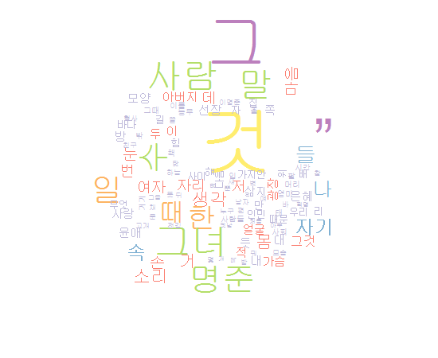

This page is for showing simple example about KoNLP with some Hangul.

Newest version of this document is on [KoNLP
github](https://github.com/haven-jeon/KoNLP/blob/master/etcs/KoNLP-API.md)

Introduction to KoNLP API
=========================

extractNoun
-----------

function for extract Nouns from sentences. Internally, runs pos tagger
and only select Nouns from set.

    library(KoNLP)

    useSejongDic()

    ## Backup was just finished!
    ## 370957 words dictionary was built.

    extractNoun("롯데마트가 판매하고 있는 흑마늘 양념 치킨이 논란이 되고 있다.")

    ## [1] "롯데마트" "판매"     "흑마늘"   "양념"     "치킨"     "논란"

    #now don't need to apply 'sapply' about multiple sentences
    #sapply(c("R은 free 소프트웨어이고, [완전하게 무보증]입니다.", "일정한 조건에 따르면, 자유롭게 이것을 재배포할수가 있습니다."), extractNoun)

    extractNoun(c("R은 free 소프트웨어이고, [완전하게 무보증]입니다.", 
                  "일정한 조건에 따르면, 자유롭게 이것을 재배포할수가 있습니다.")
                )

    ## [[1]]
    ## [1] "R"          "free"       "소프트웨어" "완전"       "하게"      
    ## [6] "무보"       "증"        
    ## 
    ## [[2]]
    ## [1] "일정"         "한"           "조건"         "자유"        
    ## [5] "이것"         "재배포할수가"

SimplePos09
-----------

This function returns pos tagged terms using KAIST tag set only using 9
main tags.

    pos <- SimplePos09("롯데마트가 판매하고 있는 흑마늘 양념 치킨이 논란이 되고 있다.")
    pos

    ## $롯데마트가
    ## [1] "롯데마트/N+가/J"
    ## 
    ## $판매하고
    ## [1] "판매/N+하고/J"
    ## 
    ## $있는
    ## [1] "있/P+는/E"
    ## 
    ## $흑마늘
    ## [1] "흑마늘/N"
    ## 
    ## $양념
    ## [1] "양념/N"
    ## 
    ## $치킨이
    ## [1] "치킨/N+이/J"
    ## 
    ## $논란이
    ## [1] "논란/N+이/J"
    ## 
    ## $되고
    ## [1] "되/P+고/E"
    ## 
    ## $있다
    ## [1] "있/P+다/E"
    ## 
    ## $.
    ## [1] "./S"

    pos$`롯데마트가`

    ## [1] "롯데마트/N+가/J"

SimplePos22
-----------

This is similar with SimplePos09 but using more detail 22 tag set.

    SimplePos22("롯데마트가 판매하고 있는 흑마늘 양념 치킨이 논란이 되고 있다.")

    ## $롯데마트가
    ## [1] "롯데마트/NC+가/JC"
    ## 
    ## $판매하고
    ## [1] "판매/NC+하고/JC"
    ## 
    ## $있는
    ## [1] "있/PX+는/ET"
    ## 
    ## $흑마늘
    ## [1] "흑마늘/NC"
    ## 
    ## $양념
    ## [1] "양념/NC"
    ## 
    ## $치킨이
    ## [1] "치킨/NC+이/JC"
    ## 
    ## $논란이
    ## [1] "논란/NC+이/JC"
    ## 
    ## $되고
    ## [1] "되/PV+고/EC"
    ## 
    ## $있다
    ## [1] "있/PX+다/EF"
    ## 
    ## $.
    ## [1] "./SF"

MorphAnalyzer
-------------

show morph analysis result.

    MorphAnalyzer("롯데마트가 판매하고 있는 흑마늘 양념 치킨이 논란이 되고 있다.")

    ## $롯데마트가
    ## [1] "롯데마트/ncn+가/jcc" "롯데마트/ncn+가/jcs"
    ## 
    ## $판매하고
    ## [1] "판매/ncpa+하고/jcj"             "판매/ncpa+하고/jct"            
    ## [3] "판매/ncpa+하/xsva+고/ecc"       "판매/ncpa+하/xsva+고/ecs"      
    ## [5] "판매/ncpa+하/xsva+고/ecx"       "판매/ncpa+하/xsva+어/ef+고/jcr"
    ## 
    ## $있는
    ## [1] "있/paa+는/etm" "있/px+는/etm" 
    ## 
    ## $흑마늘
    ## [1] "흑마늘/ncn" "흑마늘/nqq"
    ## 
    ## $양념
    ## [1] "양념/ncn"
    ## 
    ## $치킨이
    ## [1] "치킨/ncn+이/jcc" "치킨/ncn+이/jcs" "치킨/ncn+이/ncn"
    ## 
    ## $논란이
    ## [1] "논란/ncpa+이/jcc" "논란/ncpa+이/jcs" "논란/ncpa+이/ncn"
    ## 
    ## $되고
    ##  [1] "되/nbu+고/jcj"       "되/nbu+이/jp+고/ecc" "되/nbu+이/jp+고/ecs"
    ##  [4] "되/nbu+이/jp+고/ecx" "되/paa+고/ecc"       "되/paa+고/ecs"      
    ##  [7] "되/paa+고/ecx"       "되/pvg+고/ecc"       "되/pvg+고/ecs"      
    ## [10] "되/pvg+고/ecx"       "되/px+고/ecc"        "되/px+고/ecs"       
    ## [13] "되/px+고/ecx"       
    ## 
    ## $있다
    ## [1] "있/paa+다/ef" "있/px+다/ef" 
    ## 
    ## $.
    ## [1] "./sf" "./sy"

Tag information
---------------

Mindmap of KAIST tag set .

 *will provide English version of
tag set as soon as possible*

original tag was taken from [Hannanum reference
manual](http://semanticweb.kaist.ac.kr/home/index.php/HanNanum).

convertHangulStringToJamos
--------------------------

convert Hangul string to Jamo(Korean alphabet) string. return will be
char vector with each syllable.

    convertHangulStringToJamos("R는 많은 공헌자에의한 공동 프로젝트입니다")

    ##  [1] "R"      "ㄴㅡㄴ" " "      "ㅁㅏㄶ" "ㅇㅡㄴ" " "      "ㄱㅗㅇ"
    ##  [8] "ㅎㅓㄴ" "ㅈㅏ"   "ㅇㅔ"   "ㅇㅢ"   "ㅎㅏㄴ" " "      "ㄱㅗㅇ"
    ## [15] "ㄷㅗㅇ" " "      "ㅍㅡ"   "ㄹㅗ"   "ㅈㅔㄱ" "ㅌㅡ"   "ㅇㅣㅂ"
    ## [22] "ㄴㅣ"   "ㄷㅏ"

convertHangulStringToKeyStrokes
-------------------------------

Hangul string to keyboard strokes(2-bul). Strokes char will be
full-width ascii character.

    convertHangulStringToKeyStrokes("R는 많은 공헌자에의한 공동 프로젝트입니다")

    ##  [1] "R"        "ｓｍｓ"   " "        "ａｋｓｇ" "ｄｍｓ"   " "       
    ##  [7] "ｒｈｄ"   "ｇｊｓ"   "ｗｋ"     "ｄｐ"     "ｄｍｌ"   "ｇｋｓ"  
    ## [13] " "        "ｒｈｄ"   "ｅｈｄ"   " "        "ｖｍ"     "ｆｈ"    
    ## [19] "ｗｐｒ"   "ｘｍ"     "ｄｌｑ"   "ｓｌ"     "ｅｋ"

HangulAutomata
--------------

Convert from Jamo(or keystroke) sequences to Hangul syllables.

    str <- convertHangulStringToJamos("배포 조건의 상세한것에 대해서는 'license()' 또는 'licence()' 라고 입력해주십시오")
    str2 <-paste(str, collapse="")
    str2

    ## [1] "ㅂㅐㅍㅗ ㅈㅗㄱㅓㄴㅇㅢ ㅅㅏㅇㅅㅔㅎㅏㄴㄱㅓㅅㅇㅔ ㄷㅐㅎㅐㅅㅓㄴㅡㄴ 'license()' ㄸㅗㄴㅡㄴ 'licence()' ㄹㅏㄱㅗ ㅇㅣㅂㄹㅕㄱㅎㅐㅈㅜㅅㅣㅂㅅㅣㅇㅗ"

    HangulAutomata(str2)

    ## [1] "배포 조건의 상세한것에 대해서는 'license()' 또는 'licence()' 라고 입력해주십시오"

useSejongDic, useSystemDic
--------------------------

change to [Sejong](https://github.com/haven-jeon/Sejong), Hannanum
System, [NIADic](https://github.com/haven-jeon/NIADic).

    useSystemDic()

    ## Backup was just finished!
    ## 283949 words dictionary was built.

    extractNoun("성긴털제비꽃은 너무 예쁘다.")

    ## [1] "성긴털제비꽃은"

    SimplePos09("성긴털제비꽃은 너무 예쁘다.")

    ## $성긴털제비꽃은
    ## [1] "성긴털제비꽃은/N"
    ## 
    ## $너무
    ## [1] "너무/M"
    ## 
    ## $예쁘다
    ## [1] "예쁘/P+다/E"
    ## 
    ## $.
    ## [1] "./S"

    SimplePos22("성긴털제비꽃은 너무 예쁘다.")

    ## $성긴털제비꽃은
    ## [1] "성긴털제비꽃은/NC"
    ## 
    ## $너무
    ## [1] "너무/MA"
    ## 
    ## $예쁘다
    ## [1] "예쁘/PA+다/EF"
    ## 
    ## $.
    ## [1] "./SF"

    MorphAnalyzer("성긴털제비꽃은 너무 예쁘다.")

    ## $성긴털제비꽃은
    ## [1] "성긴털제비꽃/ncn+은/jxc" "성긴털제비꽃은/ncn"     
    ## [3] "성긴털제비꽃/nqq+은/jxc" "성긴털제비꽃은/nqq"     
    ## 
    ## $너무
    ## [1] "너무/mag"
    ## 
    ## $예쁘다
    ## [1] "예쁘/paa+다/ef"
    ## 
    ## $.
    ## [1] "./sf" "./sy"

    useSejongDic()

    ## Backup was just finished!
    ## 370957 words dictionary was built.

    extractNoun("성긴털제비꽃은 너무 예쁘다.")

    ## [1] "성긴털제비꽃"

    SimplePos09("성긴털제비꽃은 너무 예쁘다.")

    ## $성긴털제비꽃은
    ## [1] "성긴털제비꽃/N+은/J"
    ## 
    ## $너무
    ## [1] "너무/M"
    ## 
    ## $예쁘다
    ## [1] "예쁘/P+다/E"
    ## 
    ## $.
    ## [1] "./S"

    SimplePos22("성긴털제비꽃은 너무 예쁘다.")

    ## $성긴털제비꽃은
    ## [1] "성긴털제비꽃/NC+은/JX"
    ## 
    ## $너무
    ## [1] "너무/MA"
    ## 
    ## $예쁘다
    ## [1] "예쁘/PA+다/EF"
    ## 
    ## $.
    ## [1] "./SF"

    MorphAnalyzer("성긴털제비꽃은 너무 예쁘다.")

    ## $성긴털제비꽃은
    ## [1] "성긴털제비꽃/ncn+은/jxc" "성긴털제비꽃/ncn+은/ncn"
    ## 
    ## $너무
    ## [1] "너무/mag"
    ## 
    ## $예쁘다
    ## [1] "예쁘/paa+다/ef"
    ## 
    ## $.
    ## [1] "./sf" "./sy"

    useNIADic()

    ## Backup was just finished!
    ## 983012 words dictionary was built.

    extractNoun("성긴털제비꽃은 너무 예쁘다.")

    ## [1] "성긴털" "제비꽃"

    SimplePos09("성긴털제비꽃은 너무 예쁘다.")

    ## $성긴털제비꽃은
    ## [1] "성긴털제비꽃/N+은/J"
    ## 
    ## $너무
    ## [1] "너무/M"
    ## 
    ## $예쁘다
    ## [1] "예쁘/P+다/E"
    ## 
    ## $.
    ## [1] "./S"

    SimplePos22("성긴털제비꽃은 너무 예쁘다.")

    ## $성긴털제비꽃은
    ## [1] "성긴털제비꽃/NC+은/JX"
    ## 
    ## $너무
    ## [1] "너무/MA"
    ## 
    ## $예쁘다
    ## [1] "예쁘/PA+다/EF"
    ## 
    ## $.
    ## [1] "./SF"

    MorphAnalyzer("성긴털제비꽃은 너무 예쁘다.")

    ## $성긴털제비꽃은
    ## [1] "성긴털/ncn+제비꽃/ncn+은/jxc"      "성긴털/ncn+제비꽃/ncn+은/ncn"     
    ## [3] "성긴털/ncn+제비꽃/ncn+은/jcs"      "성긴털/ncn+제비/ncn+꽃/ncn+은/jxc"
    ## [5] "성긴털/ncn+제비/ncn+꽃/ncn+은/jcs"
    ## 
    ## $너무
    ## [1] "너무/mag"
    ## 
    ## $예쁘다
    ## [1] "예쁘/paa+다/ef"
    ## 
    ## $.
    ## [1] "./sf" "./sy"

buildDictionary
---------------

User can make own dictionary using NIAdic and Sejong additional
packages.

    txt <- '미국 싱크탱크 전략국제문제연구소(CSIS)의 빅터 차 한국석좌는 9일(현지시간) 미국의 제45대 대통령으로 당선된 도널드 트럼프가 전시작전통제권(전작권)을 한국에 조기에 넘길 가능성이 있다고 전망했다.'

    buildDictionary(ext_dic = c('sejong', 'woorimalsam'),user_dic = data.frame(term="전작권", tag='ncn'), category_dic_nms=c('political'))

    ## 718105 words dictionary was built.

    extractNoun(txt)

    ##  [1] "미국"                     "싱크탱크"                
    ##  [3] "전략국제문제연구소(CSIS)" "빅터"                    
    ##  [5] "차"                       "한국"                    
    ##  [7] "석좌"                     "9일(현지시간)"           
    ##  [9] "미국"                     "제45대"                  
    ## [11] "대통령"                   "당선"                    
    ## [13] "도널드"                   "트럼프"                  
    ## [15] "전시"                     "작전"                    
    ## [17] "통제"                     "전작권"                  
    ## [19] "한국"                     "조기"                    
    ## [21] "가능성"                   "전망"

Use buildDictionary for mergeUserDic (mergeUserDic is deprecated)
-----------------------------------------------------------------

Function can be usually used for appending new terms to user dictionary.

    #Rather than simply using the system dictionary, 
    #it is better to extract nouns based on the rich vocabulary of the Korean dictionary(wooromalsam).
    buildDictionary(ext_dic = "woorimalsam")

    ## 629897 words dictionary was built.

    extractNoun("할리우드 톱스타 레오나르도 디카프리오는 '선행 전도사'다운 행보를 이어갔다.")

    ##  [1] "할리우드"   "톱스타"     "레오나르도" "디카"       "프리"      
    ##  [6] "오"         "선행"       "전도사"     "다운"       "행보"      
    ## [11] "이"

    buildDictionary(ext_dic = "woorimalsam", user_dic=data.frame("디카프리오", "ncn"),replace_usr_dic = T)

    ## 629898 words dictionary was built.

    extractNoun("할리우드 톱스타 레오나르도 디카프리오는 '선행 전도사'다운 행보를 이어갔다.")

    ## [1] "할리우드"   "톱스타"     "레오나르도" "디카프리오" "선행"      
    ## [6] "전도사"     "다운"       "행보"       "이"

    # get dictionary as data.frame
    head(get_dictionary('user_dic'))

    ##         term tag
    ## 1 디카프리오 ncn

Auto-spacing
------------

Sometimes it is necessary to analyze sentences that are not spatially
separated. In this case, automatic spacing is provided.

    ## Backup was just finished!
    ## 283949 words dictionary was built.

    extractNoun("아버지가방에들어가셨다.")

    ## [1] "아버지가방에들어가셨다"

    extractNoun("아버지가방에들어가셨다.", autoSpacing = T)

    ## [1] "아버지" "방"

    MorphAnalyzer("아버지가방에들어가셨다.", autoSpacing = T)

    ## $아버지가
    ## [1] "아버지/ncn+가/jcc" "아버지/ncn+가/jcs"
    ## 
    ## $방에
    ## [1] "방/nbu+에/jca" "방/ncn+에/jca"
    ## 
    ## $들어가
    ## [1] "들/pvg+어/ecx+가/px+아/ecs" "들/pvg+어/ecx+가/px+아/ecx"
    ## [3] "들/pvg+어/ecx+가/px+아/ef"  "듣/pvg+어/ecx+가/px+아/ecs"
    ## [5] "듣/pvg+어/ecx+가/px+아/ecx" "듣/pvg+어/ecx+가/px+아/ef" 
    ## [7] "들어가/pvg+아/ecs"          "들어가/pvg+아/ecx"         
    ## [9] "들어가/pvg+아/ef"          
    ## 
    ## $셨다
    ## [1] "시/paa+었/ep+다/ef"
    ## 
    ## $.
    ## [1] "./sf" "./sy"

    #SimplePos09("아버지가방에들어가셨다.", autoSpacing = T)

    SimplePos22("아버지가방에들어가셨다.", autoSpacing = T)

    ## $아버지가
    ## [1] "아버지/NC+가/JC"
    ## 
    ## $방에
    ## [1] "방/NC+에/JC"
    ## 
    ## $들어가
    ## [1] "들/PV+어/EC+가/PX+아/EC"
    ## 
    ## $셨다
    ## [1] "시/PA+었/EP+다/EF"
    ## 
    ## $.
    ## [1] "./SF"

Examples
========

Wordcloud example
-----------------

Example will draw wordcloud after analyze Korean famous novel named
"광장\_최인훈"(can't include novel cause copyright, but you can find
other good txt files).

1.  read txt file.
2.  parse using extractNoun().
3.  draw wordcloud with word frequency

    library(KoNLP) library(RColorBrewer) library(wordcloud)

    f &lt;- file("광장\_최인훈.txt", blocking=F) txtLines &lt;-
    readLines(f) nouns &lt;- sapply(txtLines, extractNoun,
    USE.NAMES=F) close(f)

    wordcount &lt;- table(unlist(nouns)) pal &lt;- brewer.pal(12,"Set3")
    pal &lt;- pal\[-c(1:2)\]
    wordcloud(names(wordcount),freq=wordcount,scale=c(6,0.3),min.freq=25, random.order=T,rot.per=.1,colors=pal)

Korean Twitter Analysis
-----------------------

    #referenced from http://www.rdatamining.com/

    ## @knitr init
    library(twitteR)
    # 
    # n <- 200
    # 
    # keyword <- "삼성전자"
    # 
    # keyword <- enc2utf8(keyword)
    # 
    # rdmTweets <- searchTwitter(keyword,  n)

    load(url("http://dl.dropbox.com/u/8686172/twitter.RData"))

    nDocs <- length(rdmTweets)

    ## @knitr preprocess
    library(KoNLP)
    library(tm)

    df <- do.call("rbind", lapply(rdmTweets, as.data.frame))

    removeTwit <- function(x) {gsub("@[[:graph:]]*", "", x)}

    df$ptext <- sapply(df$text, removeTwit)

    removeURL <- function(x) { gsub("http://[[:graph:]]*", "", x)}

    df$ptext <- sapply(df$ptext, removeURL)
    useSejongDic()
    df$ptext <- sapply(df$ptext, function(x) {paste(extractNoun(x), collapse=" ")}) 

    #build corpus
    myCorpus_ <- Corpus(VectorSource(df$ptext))
    myCorpus_ <- tm_map(myCorpus_, removePunctuation)
    myCorpus_ <- tm_map(myCorpus_, removeNumbers)
    myCorpus_ <- tm_map(myCorpus_, tolower)
    myStopwords <- c(stopwords('english'), "rt")
    myCorpus_ <-tm_map(myCorpus_, removeWords, myStopwords)

    ## @knitr eda

    myTdm <- TermDocumentMatrix(myCorpus, control=list(wordLengths=c(2,Inf)))

    #inspect frequent term
    findFreqTerms(myTdm, lowfreq=10)

    #inspect associations 
    findAssocs(myTdm,'lg',0.25)

    ## @knitr barplot
    library(ggplot2)

    termFrequency <- rowSums(as.matrix(myTdm))
    termFrequency <- subset(termFrequency,termFrequency>=10)

    ggplot(data.frame(term = names(termFrequency), freq=termFrequency), aes(term, freq)) + geom_bar() + coord_flip()

    ## @knitr wordcloud
    #Word Cloud 

    library(wordcloud)

    m <- as.matrix(myTdm)

    wordFreq <- sort(rowSums(m),decreasing=TRUE)

    set.seed(375)

    pal <- brewer.pal(8,"Dark2")

    wordcloud(words=names(wordFreq),freq=wordFreq,min.freq=10,random.order=F, rot.per=.1,colors=pal)

    ## @knitr hclust
    myTdm2<-removeSparseTerms(myTdm,sparse=0.95)
    m2<-as.matrix(myTdm2)

    distMatrix<-dist(scale(m2))

    fit<-hclust(distMatrix,method="ward")

    plot(fit)

    rect.hclust(fit,k=10)

    #(groups<-cutree(fit,k=10))

    ## @knitr kmeans
    m3 <- t(m2)
    k <- 4
    kmres <- kmeans(m3, k)

    round(kmres$centers, digits=3)

    for(i in 1:k){
      cat(paste("cluster ", i, " : ", sep=""))
      s <- sort(kmres$centers[i, ], decreasing=T)
      cat(names(s)[1:3], "\n")
      #print(head(rdmTweets[which(kmres$cluster ==i)],n=3))
    }

    ## @knitr kmedoid
    library(fpc)
    pamResult <- pamk(m3, metric="manhattan")
    (k <- pamResult$nc)

    pamResult <- pamResult$pamobject
    #print cluster medoids

    for(i in 1:k){
      cat(paste("cluster",i,":"))
      cat(colnames(pamResult$medoids)[which(pamResult$medoids[i,]==1)],"\n")
      # print tweets in cluster i
      #print(rdmTweets[pamResult$clustering==i])
    }

Korean Twitter Analysis
-----------------------

    #referenced from http://www.rdatamining.com/

    ## @knitr init
    library(twitteR)
    # 
    # n <- 200
    # 
    # keyword <- "삼성전자"
    # 
    # keyword <- enc2utf8(keyword)
    # 
    # rdmTweets <- searchTwitter(keyword,  n)

    load(url("http://dl.dropbox.com/u/8686172/twitter.RData"))

    nDocs <- length(rdmTweets)

    ## @knitr preprocess
    library(KoNLP)
    library(tm)

    df <- do.call("rbind", lapply(rdmTweets, as.data.frame))

    removeTwit <- function(x) {gsub("@[[:graph:]]*", "", x)}

    df$ptext <- sapply(df$text, removeTwit)

    removeURL <- function(x) { gsub("http://[[:graph:]]*", "", x)}

    df$ptext <- sapply(df$ptext, removeURL)
    useSejongDic()
    df$ptext <- sapply(df$ptext, function(x) {paste(extractNoun(x), collapse=" ")}) 

    #build corpus
    myCorpus_ <- Corpus(VectorSource(df$ptext))
    myCorpus_ <- tm_map(myCorpus_, removePunctuation)
    myCorpus_ <- tm_map(myCorpus_, removeNumbers)
    myCorpus_ <- tm_map(myCorpus_, tolower)
    myStopwords <- c(stopwords('english'), "rt")
    myCorpus_ <-tm_map(myCorpus_, removeWords, myStopwords)

    ## @knitr eda

    myTdm <- TermDocumentMatrix(myCorpus, control=list(wordLengths=c(2,Inf)))

    #inspect frequent term
    findFreqTerms(myTdm, lowfreq=10)

    #inspect associations 
    findAssocs(myTdm,'lg',0.25)

    ## @knitr barplot
    library(ggplot2)

    termFrequency <- rowSums(as.matrix(myTdm))
    termFrequency <- subset(termFrequency,termFrequency>=10)

    ggplot(data.frame(term = names(termFrequency), freq=termFrequency), aes(term, freq)) + geom_bar() + coord_flip()

    ## @knitr wordcloud
    #Word Cloud 

    library(wordcloud)

    m <- as.matrix(myTdm)

    wordFreq <- sort(rowSums(m),decreasing=TRUE)

    set.seed(375)

    pal <- brewer.pal(8,"Dark2")

    wordcloud(words=names(wordFreq),freq=wordFreq,min.freq=10,random.order=F, rot.per=.1,colors=pal)

    ## @knitr hclust
    myTdm2<-removeSparseTerms(myTdm,sparse=0.95)
    m2<-as.matrix(myTdm2)

    distMatrix<-dist(scale(m2))

    fit<-hclust(distMatrix,method="ward")

    plot(fit)

    rect.hclust(fit,k=10)

    #(groups<-cutree(fit,k=10))

    ## @knitr kmeans
    m3 <- t(m2)
    k <- 4
    kmres <- kmeans(m3, k)

    round(kmres$centers, digits=3)

    for(i in 1:k){
      cat(paste("cluster ", i, " : ", sep=""))
      s <- sort(kmres$centers[i, ], decreasing=T)
      cat(names(s)[1:3], "\n")
      #print(head(rdmTweets[which(kmres$cluster ==i)],n=3))
    }

    ## @knitr kmedoid
    library(fpc)
    pamResult <- pamk(m3, metric="manhattan")
    (k <- pamResult$nc)

    pamResult <- pamResult$pamobject
    #print cluster medoids

    for(i in 1:k){
      cat(paste("cluster",i,":"))
      cat(colnames(pamResult$medoids)[which(pamResult$medoids[i,]==1)],"\n")
      # print tweets in cluster i
      #print(rdmTweets[pamResult$clustering==i])
    }

